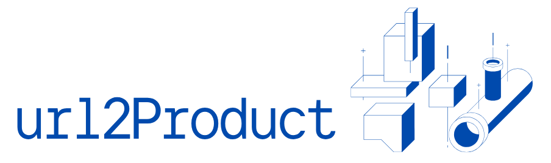
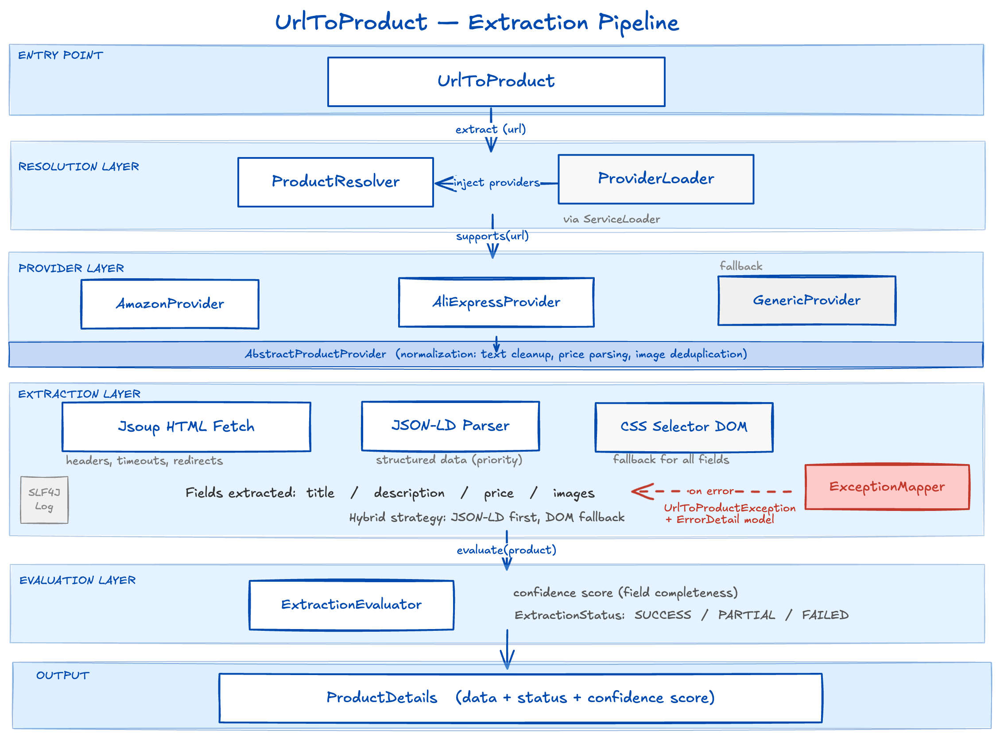

<p align="center">
  
</p>

<h1 align="center">url2Product</h1>

<p align="center">
  
  
  
 <a href="https://github.com/DinethDilhara/url2product/packages/2979986">
  
 </a>
</p>

Turn any e-commerce URL into structured product data. A lightweight Java library built on a pluggable provider architecture with built-in support for Amazon, AliExpress, and any custom storefront.

---

## Table of Contents

- [Table of Contents](#table-of-contents)
- [Overview](#overview)
- [Features](#features)
- [Requirements](#requirements)
- [Installation](#installation)
- [Quick Start](#quick-start)
- [Output Model](#output-model)
- [Extraction Quality System](#extraction-quality-system)
- [Provider System](#provider-system)
- [Custom Providers](#custom-providers)
- [Error Handling](#error-handling)
- [Logging](#logging)
- [Architecture](#architecture)
- [Design Goals](#design-goals)
- [License](#license)
- [Author](#author)

---

## Overview

`url-to-product` abstracts the complexity of scraping and parsing e-commerce product pages into a single, clean API call. The library dynamically selects the most suitable provider for a given URL, extracts product data using a hybrid JSON-LD and DOM parsing strategy, and returns a structured result with a built-in confidence score.

---

## Features

- Pluggable provider system with built-in support for Amazon, AliExpress, and a generic fallback
- Fast HTML fetching via Jsoup with proper headers, timeouts, and redirect handling
- Hybrid extraction strategy: JSON-LD structured data (priority) with CSS selector DOM fallback
- Built-in extraction scoring and confidence evaluation per result
- Clean provider abstraction for building custom site-specific extensions
- Structured logging via SLF4J
- Consistent exception model with normalized error types

---

## Requirements

- Java 17 or later
- Jsoup 1.18 or later
- Jackson Databind 2.x

---

## Installation

Add the following dependency to your `pom.xml`:

```xml
<dependency>
    <groupId>io.github.dinethdilhara</groupId>
    <artifactId>url-to-product</artifactId>
    <version>1.0.0</version>
</dependency>
```

---

## Quick Start

```java
import io.github.dinethdilhara.urltoproduct.exception.UrlToProductException;
import io.github.dinethdilhara.urltoproduct.model.ExtractionStatus;
import io.github.dinethdilhara.urltoproduct.model.ProductDetails;
import io.github.dinethdilhara.urltoproduct.core.UrlToProduct;

import org.slf4j.LoggerFactory;
import org.slf4j.Logger;

public class Main {

    private static final Logger log = LoggerFactory.getLogger(Main.class);

    public static void main(String[] args) {

        UrlToProduct extractor = new UrlToProduct();
        String url = "https://example.com/product";

        try {
            ProductDetails product = extractor.extract(url);

            log.info("Extraction completed | url={} | status={} | confidence={}",
                    url,
                    product.getStatus(),
                    product.getConfidenceScore()
            );

            if (product.getStatus() == ExtractionStatus.SUCCESS) {

                log.info("Product extracted successfully");

                System.out.println("Title: " + product.getTitle());
                System.out.println("Price: " + product.getPrice());

            } else if (product.getStatus() == ExtractionStatus.PARTIAL) {

                log.warn("Partial extraction result | url={} | confidence={}",
                        url,
                        product.getConfidenceScore()
                );

            } else {

                log.warn("Low quality extraction (FAILED) | url={}", url);
            }

        } catch (UrlToProductException e) {

            log.error(
                    "Product extraction failed | url={} | code={} | type={} | message={}",
                    url,
                    e.getError().code(),
                    e.getError().type(),
                    e.getError().message(),
                    e
            );
        }
    }
}

```

---

## Output Model

The `extract()` method returns a `ProductDetails` object with the following fields:

```java
ProductDetails {
    String           link;
    String           title;
    String           description;
    BigDecimal       price;
    List<String>     images;
    ExtractionStatus status;           // SUCCESS, PARTIAL, FAILED
    int              confidenceScore;  // 0–100
}
```

---

## Extraction Quality System

Every extraction is automatically evaluated by `ExtractionEvaluator`, which scores the result based on field completeness and assigns a status.

| Confidence Score | Status  |
| ---------------- | ------- |
| 80 – 100         | SUCCESS |
| 40 – 79          | PARTIAL |
| < 40             | FAILED  |

You can also invoke the evaluator directly:

```java
ExtractionResult result = ExtractionEvaluator.evaluate(product);
```

---

## Provider System

The library uses Java's `ServiceLoader` mechanism to discover all registered `ProductProvider` implementations at runtime. When `extract(url)` is called, `ProductResolver` iterates through the available providers and delegates to the first one whose `supports(url)` method returns `true`.

**Built-in providers:**

| Provider             | Target                   |
| -------------------- | ------------------------ |
| `AmazonProvider`     | Amazon product pages     |
| `AliExpressProvider` | AliExpress product pages |
| `GenericProvider`    | Any other URL (fallback) |

Each provider fetches the page via Jsoup and applies a two-phase extraction strategy: JSON-LD structured data is parsed first when available, with CSS selector-based DOM extraction as the fallback. Common normalization logic — text cleanup, price parsing, and image deduplication — is handled centrally in `AbstractProductProvider`.

---

## Custom Providers

You can extend the library with site-specific providers by subclassing `AbstractProductProvider`:

```java
public class MyStoreProvider extends AbstractProductProvider {

    @Override
    protected boolean matchesHost(String host) {
        return host.contains("mystore.com");
    }

    @Override
    protected String providerName() {
        return "MyStore";
    }

    @Override
    protected String extractTitle(Document doc) {
        return extractBySelectors(doc, new String[]{"h1.product-title"});
    }
}
```

Register your provider by adding it to the appropriate `ServiceLoader` configuration file so it is discovered automatically at runtime alongside the built-in providers.

---

## Error Handling

All exceptions are normalized into a consistent hierarchy rooted at `UrlToProductException`. Each exception carries a structured `ErrorDetail` model, making it straightforward to handle errors uniformly in your application.

```
UrlToProductException             // Main exception exposed by the library        
├── UnsupportedUrlException       // No provider matched the given URL
└── ProviderExtractionException   // Extraction failed during parsing or fetching
```

---

## Logging

The library uses the SLF4J API. No logging implementation is bundled — add the binding of your choice to your project.

To enable simple console logging during development:

```xml
<dependency>
    <groupId>org.slf4j</groupId>
    <artifactId>slf4j-simple</artifactId>
    <version>2.0.13</version>
</dependency>
```

Log output covers:

- Provider selection and routing decisions
- Extraction success or failure per field
- Debug-level parsing flow for troubleshooting

---

## Architecture

The extraction pipeline follows a linear, layered flow:



Any error at any stage is intercepted by `ExceptionMapper` and converted into a `UrlToProductException` with an `ErrorDetail` payload before propagating to the caller.

---

## Design Goals

- **Simple API** - a single method call is all that is needed for most use cases
- **Extensible providers** - add support for any site without modifying core library code
- **Stable extraction** - hybrid parsing strategy maximizes data coverage across diverse site structures
- **Clean separation of concerns** - fetching, parsing, normalization, and evaluation are each isolated
- **Production-ready observability** - structured logging and consistent error models from the ground up

---

## License

Apache License 2.0. See [LICENSE](LICENSE) for details.

---

## Author

**Dineth Dilhara** 
[github.com/dinethdilhara](https://github.com/dinethdilhara)
